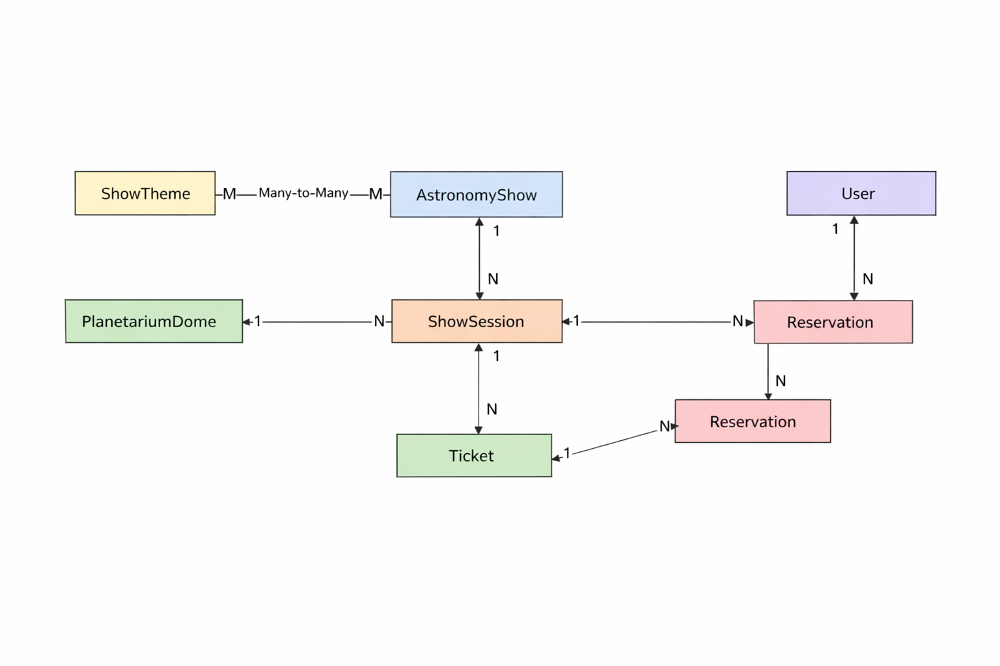

# Planetarium API

Planetarium API is a Django REST Framework project that allows managing planetarium shows, domes, sessions, reservations, and tickets.  
This project was implemented as a Portfolio Project following the Cinema Shop example.

---

## Features
- Manage astronomy shows and their themes
- Manage planetarium domes with rows and seats
- Schedule show sessions in domes
- Create reservations and tickets for sessions
- Browsable API with Django REST Framework
- Interactive API documentation via Swagger (drf-spectacular)

---

## Project Structure
- `planetarium_service/` – main Django project (settings, URLs, WSGI/ASGI)
- `planetarium/` – application with models, serializers, views, and admin
- `requirements.txt` – dependencies
- `README.md` – project documentation

---

## Installation & Setup

Clone the repository and switch to the **develop** branch:

git clone <your-repo-url>
cd planetarium-api
git checkout develop

---

## Create and activate a virtual environment:
python -m venv .venv
source .venv/bin/activate   # Linux/Mac
.venv\Scripts\activate      # Windows

---

## Install dependencies:
pip install -r requirements.txt

---

## Run migrations:
python manage.py migrate

---

## Create a superuser (for Django Admin):
python manage.py createsuperuser

---

## Start the server:
python manage.py runserver

---

## Usage
- Admin panel:http://127.0.0.1:8000/admin/
- API root:http://127.0.0.1:8000/api/
- API documentation (Swagger):http://127.0.0.1:8000/api/docs/

## Database Structure
The project includes the following entities:
ShowTheme – themes of astronomy shows
AstronomyShow – shows with description and themes
PlanetariumDome – domes with rows and seats
ShowSession – scheduled sessions of shows in domes
Reservation – reservations created by users
Ticket – tickets linked to reservations and sessions

## Database Diagram

The following diagram represents the relationships between models:

- ShowTheme ↔ AstronomyShow (Many-to-Many)
- AstronomyShow → ShowSession (One-to-Many)
- PlanetariumDome → ShowSession (One-to-Many)
- ShowSession → Ticket (One-to-Many)
- Reservation → Ticket (One-to-Many)
- User → Reservation (One-to-Many)

## Database Diagram
The following diagram represents the relationships between models:

## Screenshots
Attach screenshots of:
Browsable API endpoints
Admin panel with registered models
Swagger documentation

## License
This project is licensed under the MIT License
